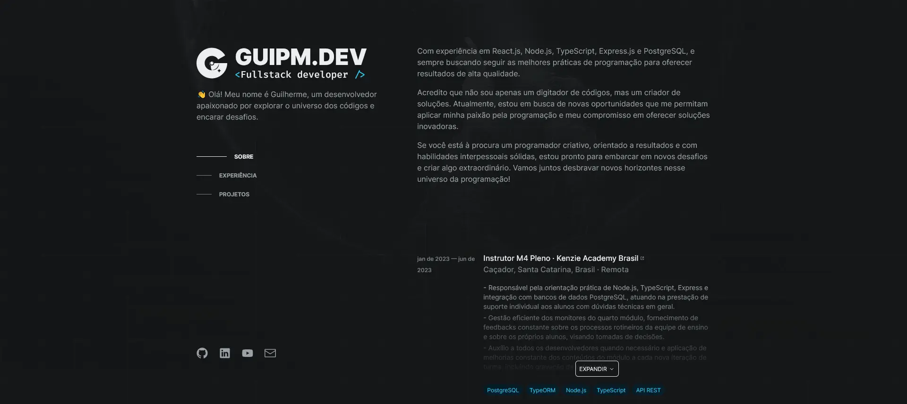

# gui.pm

<p align="right">
  
  <a href="./README.pt-br.md" title="Read the README in Brazilian Portuguese">
    
  </a>
</p>

<p align="center">
  <a href="https://gui.pm/" title="Open gui.pm">
    
  </a>
</p>

<p align="center">
  <a href="https://gui.pm/">gui.pm</a> is my digital resume website: a focused, static, interactive profile for support, internal development, diagnostics, SQL, automation, and internal systems work.
</p>

<p align="center">
  <a href="https://github.com/guipmilek/gui.pm/commits/main">
    
  </a>
  
  <a href="./LICENSE">
    
  </a>
  <a href="https://vercel.com/">
    
  </a>
</p>



<p align="center">
  <a href="https://gui.pm/">Open the website ↗</a>
</p>

## Overview

This repository contains the production website for `gui.pm`. It is a Next.js App Router application using local static data instead of a separate backend.

`guipm.dev` is a separate website focused on my technical work and projects. Links to `guipm.dev` inside profile/project data are intentional cross-links, not this website's canonical identity.

## Features

- Static digital resume content rendered by Next.js.
- Mobile-first layout with a custom cursor and interactive background on desktop.
- PandaCSS styling with generated `styled-system` files ignored from Git.
- SEO metadata, web manifest, favicons, resume PDF route redirect, and Vercel Analytics.
- No JSON Server, no local API routes, and no required environment variables.

## Stack

- Next.js 16 and React 19.
- TypeScript with strict mode.
- PandaCSS for styling and design tokens.
- React Icons and Fluent Emoji for UI details.
- Vercel Analytics and Vercel deployment.

## Project Structure

```txt
src/app/              App Router pages, layout, errors, and page styles
src/components/       UI sections, cards, cursor, background, and glass effects
src/data/             Static content rendered by the website
src/providers/        Static data provider used by server components
src/theme/            PandaCSS tokens, semantic tokens, text styles, and globals
public/               Favicons, manifest, resume PDF, and public images
```

## Requirements

- Node.js `>=22.13.0`.
- npm, using the committed `package-lock.json`.

## Local Development

1. Install dependencies:

```sh
npm install
```

2. Start the development server:

```sh
npm run dev
```

3. Open `http://localhost:3000/`.

The `prepare` script runs `panda codegen` after install. If needed, run it manually:

```sh
npm run prepare
```

## Production Build

```sh
npm run build
```

The build script runs `panda codegen && next build` so Vercel and local builds always generate PandaCSS artifacts before compiling Next.js.

## Deploying To Vercel

Recommended Vercel settings:

- Framework Preset: `Next.js`.
- Install Command: `npm install`.
- Build Command: `npm run build`.
- Output Directory: leave default.
- Node.js Version: `22.x`.
- Environment Variables: none required.

The canonical production domain is `https://gui.pm/`.

## Scripts

```sh
npm run dev       # Start local development server
npm run build     # Generate PandaCSS and build for production
npm run start     # Start the production Next.js server locally
npm run lint      # Run ESLint
npm run lint:fix  # Run ESLint with automatic fixes
```

## Data Model

All website data is stored locally in `src/data` and accessed through `staticDataProvider`. The old JSON Server compatibility layer and `/api/*` routes were removed because the final website no longer consumes or exposes that backend surface.

## License

This project is licensed under the MIT License. See [LICENSE](./LICENSE).

## Acknowledgments

- Inspired by Brittany Chiang's resume-site structure.
- Inspired by Adenekan Wonderful's cursor/background interaction style.
- Built and maintained by [Guilherme Milék](https://gui.pm/).
